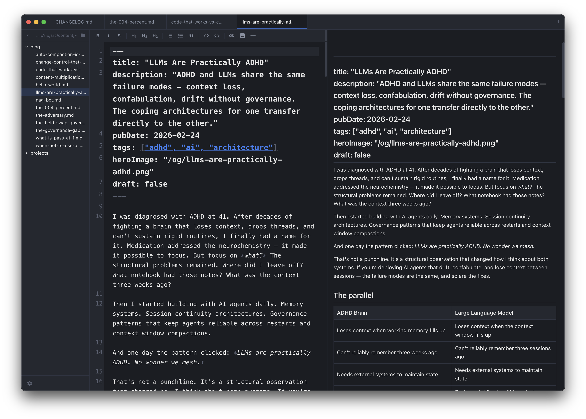
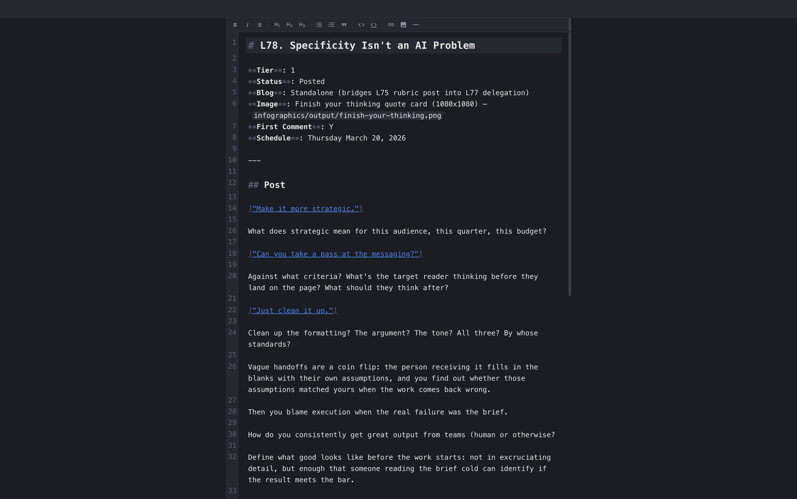
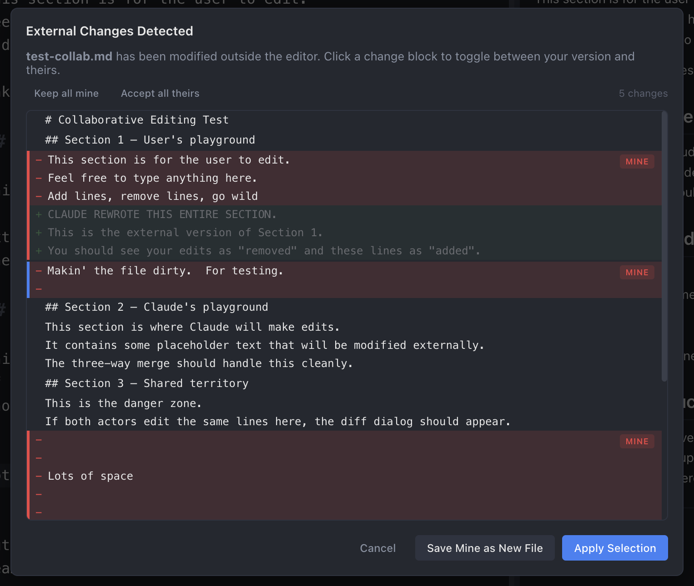
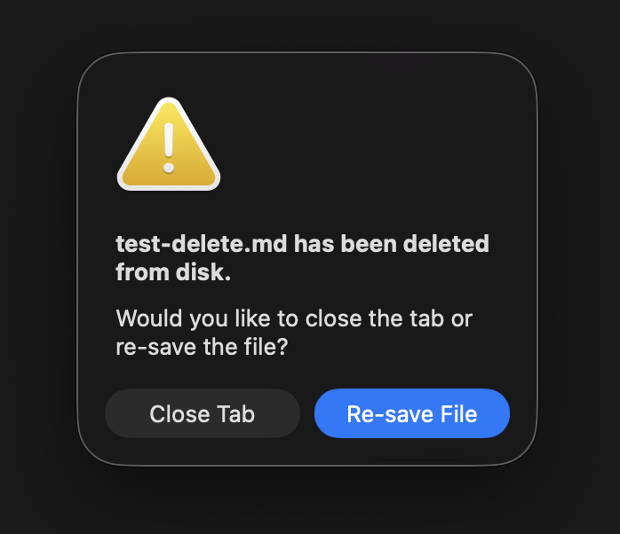
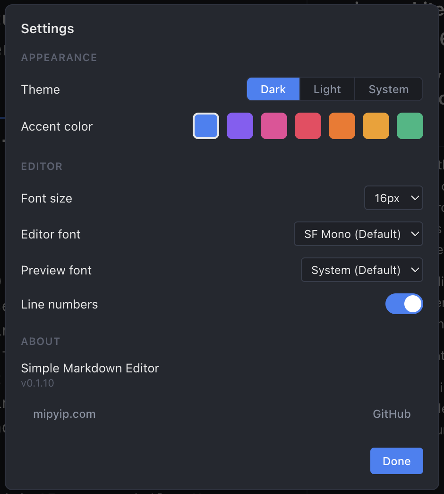

# Simple Markdown Editor

A dead simple markdown editor for macOS. Fast, focused, and free of bloat.

I live in markdown daily. Every editor I tried was either too expensive, too slow, too feature-rich, or too buggy. So I built the one I actually wanted to use — three panes, no cloud, no account, no subscription. Just a clean editor, a live preview, and a file browser that stays out of your way.

I also work with AI coding tools constantly — Claude, Copilot, Cursor — and needed an editor that could handle two authors on the same file without losing anyone's work. Simple Markdown Editor has three-way merge built in: if you and an external tool edit different parts of the same file, the changes combine seamlessly. If you collide on the same lines, an interactive diff view lets you pick which changes to keep, hunk by hunk. It's the only markdown editor I know of that treats concurrent editing as a first-class workflow.

[](https://github.com/avanrossum/a-simple-markdown-editor/releases/latest)
[](LICENSE)
[](https://mipyip.com/products/simple-markdown-editor)

[Product Page](https://mipyip.com/products/simple-markdown-editor) · [Blog Post](https://mipyip.com/blog/simple-markdown-editor)

## Download

Grab the latest `.dmg` from [GitHub Releases](https://github.com/avanrossum/a-simple-markdown-editor/releases/latest). Open it, drag to Applications, done.

Signed and notarized with Apple — no Gatekeeper warnings. macOS 12+ required. Apple Silicon supported.

## Screenshots

<table>
<tr>
<td width="50%">
<strong>Three-pane layout</strong><br>
<sub>File browser, editor, live preview with bidirectional scroll sync</sub><br><br>

</td>
<td width="50%">
<strong>Focus mode</strong><br>
<sub>Distraction-free fullscreen editing with centered content</sub><br><br>

</td>
</tr>
<tr>
<td width="50%">
<strong>Interactive diff view</strong><br>
<sub>Per-hunk accept/reject when resolving conflicts with external changes</sub><br><br>

</td>
<td width="50%">
<strong>File deletion detection</strong><br>
<sub>Prompt to close or re-save when a file is deleted from disk</sub><br><br>

</td>
</tr>
<tr>
<td width="50%">
<strong>Settings</strong><br>
<sub>Theme, accent color, fonts, font size, auto-save, line numbers</sub><br><br>

</td>
<td width="50%">
</td>
</tr>
</table>

## Features

| | |
|---|---|
| **Editor** | CodeMirror 6 with markdown syntax highlighting, formatting toolbar with smart toggle detection, heading cycling, multi-line list handling, and full keyboard shortcuts (⌘B, ⌘I, ⌘K, etc.). Search and replace with case sensitivity and match navigation. Per-tab undo history. |
| **Live Preview** | GitHub Flavored Markdown in real time. Bidirectional scroll sync. Local and remote images inline. Clickable links — `.md` files open in a new tab, external links open in your browser. |
| **Focus Mode** | Distraction-free fullscreen editing. Just the toolbar and editor, centered at a comfortable column width. Auto-saves in the background. ESC or ⌘W to return. Via right-click tab menu or ⌘⇧F. |
| **File Browser** | Expandable directory tree with auto-refresh. Context menu: new file, new folder, rename, delete (trash), show in Finder, copy path, favorites, find in folder. |
| **Favorites** | Pin files and folders for quick access. Drag-and-drop reordering. Stale path detection for unmounted drives. |
| **Tabs** | Dirty indicators, per-tab scroll/cursor restore, context menu (show in Finder, copy path, close, close others, close to right, focus mode). Auto-scrolls to keep active tab visible. |
| **Auto-Save** | Optional, with configurable delay (1–10s). Toggle in Settings. Useful when collaborating with external tools. |
| **Export** | File > Export As > PDF or HTML. Clean light-theme styling with inline CSS, no dependencies. |
| **Session Restore** | Tabs, active tab, folder, and window bounds persist across restarts. Multi-window support (⌘⇧N). |
| **External Changes** | Three-way merge when you and an external tool edit different parts of the same file — changes combine seamlessly. Same-line conflicts show an interactive per-hunk diff view with click-to-toggle accept/reject. Detects externally deleted files with close or re-save prompt. |
| **Customization** | Dark, light, or system themes. 7 accent colors. Editor font (SF Mono, Menlo, Monaco, Courier New, Andale Mono), preview font (Helvetica Neue, Georgia, Palatino, Avenir Next, Charter), font size, line numbers, resizable panes. |
| **File Associations** | Registers for `.md`, `.markdown`, `.mdown`, `.mkd`, `.mkdn`, `.mdwn`, `.mdx`, `.txt`. Shows in Finder's "Open With". |
| **Auto-Updates** | Checks every 4 hours. Background download. One-click "Restart & Install" with release notes. |

## What It Doesn't Do

No cloud sync. No collaboration. No plugin system. No Vim mode. No WYSIWYG. No proprietary format. No account creation. No subscription. No telemetry.

Your files are plain markdown on disk. Open them with anything, anywhere, forever.

## Security

This app underwent an adversarial security review with comprehensive hardening:

- **XSS prevention** — DOMPurify sanitizes all markdown before rendering in the preview pane
- **Sandbox enabled** — Chromium sandbox and context isolation enforced on all windows
- **Filesystem access control** — Path validation limits access to home directory and /Volumes; sensitive directories (.ssh, .gnupg, .aws) blocked
- **Path traversal protection** — `local-resource://` protocol restricted to image file extensions
- **URL scheme allowlisting** — `shell.openExternal` limited to https://, http://, mailto:
- **Content Security Policy** — Tightened CSP on settings and update dialogs
- **No network calls** — except auto-update checks to GitHub Releases

## Getting Started

### From release

Download the `.dmg` from [Releases](https://github.com/avanrossum/a-simple-markdown-editor/releases/latest), open it, drag to Applications.

### From source

```bash
cd simple_markdown_editor
npm install
npm run dev
```

| Command | Description |
|---------|-------------|
| `npm run dev` | Development mode with hot reload |
| `npm run build` | Production build |
| `npm run release` | Signed build + GitHub release |

Release builds require Apple Developer ID credentials (APPLE_ID, APPLE_APP_SPECIFIC_PASSWORD, APPLE_TEAM_ID) for code signing and notarization.

## Tech Stack

| Layer | Technology |
|-------|------------|
| Framework | Electron 33 |
| UI | React 18 |
| Editor | CodeMirror 6 |
| Markdown | marked (GitHub Flavored Markdown) |
| Build | Vite 6 + electron-builder |
| Security | DOMPurify, sandbox, CSP |
| File Watching | chokidar |
| Diffing | diff (external change resolution) |
| Updates | electron-updater (GitHub Releases) |
| Language | JavaScript (TypeScript migration planned) |

## Repository Structure

The application source lives in `simple_markdown_editor/`. The outer repository holds project-level files (README, license, changelog, roadmap).

```
.
├── README.md
├── LICENSE
├── CHANGELOG.md
├── ROADMAP.md
├── Architecture.md
└── simple_markdown_editor/
    ├── package.json
    ├── vite.config.js
    ├── electron-builder.config.js
    ├── build/              # App icon and entitlements
    ├── scripts/            # Icon generation and release scripts
    └── src/
        ├── main/           # Electron main process (window lifecycle, IPC, file I/O)
        ├── renderer/       # React UI (editor, preview, file browser, tabs, toolbar)
        ├── settings/       # Settings overlay
        └── update-dialog/  # Auto-update UI
```

## Contributing

This is a personal project built for my own use, but contributions are welcome. Open an issue first if you're planning something big.

## License

[MIT](LICENSE) — made by [MipYip](https://mipyip.com)
